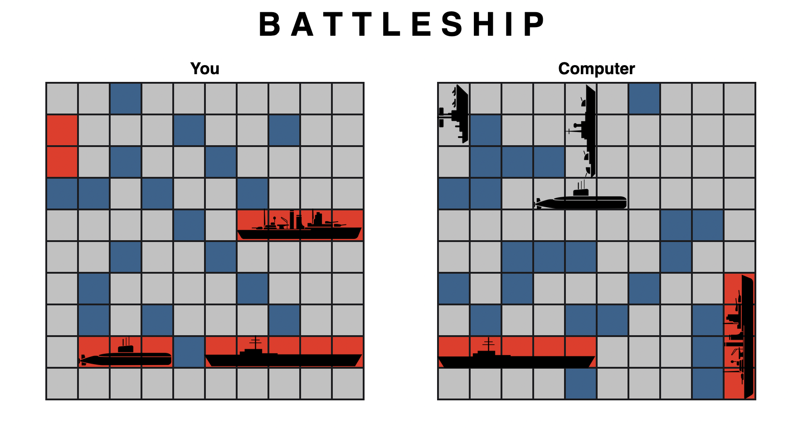

# battleship

this is project 6 from the odin project's full stack javascript curriculum

## project objectives

1. create a single-player battleship game against a computer-generated opponent
2. implement testing via Jest throughout the design process

## game features

1. a drag-and-drop option to place ships built entirely with vanilla JS
2. uses ship images for an improved UX/UI that make use of calculated CSS offsets for proper placement
3. a random placement button for users to simplify the placement of their ships
4. an improved computer AI that selects random squares until a hit is registered, at which point the computer hits adjacent coordinates until the ship is sunk
5. when a user sinks a ship, the image of the sunken ship is displayed. to me, this simulates the actual game during which your opponent must tell you which ship is sunk.

## areas for improvement

1. the computer AI does not account for hitting a ship that is adjacent to the intitially-hit ship. once the computer AI sinks the initially-hit ship it currently will not return to the ship that was inadvertently hit. to improve this functionality would require some refactoring that i may return to in the future.
2. i began the project enthusiastically testing via jest but abandoned testing once the code got sufficiently complex; in reality, this was exactly the wrong time to ignore testing.
3. both the drag-and-drop and the computer AI functionalities proved much more complex than i had originally expected, thus they both resulted in significant muddling of my code and adversely affected its readability. further, i encountered serious state issues that resulted in me opting to refresh the page for a new game rather than play a game of whack-a-mole.

## how to play

1. choose to randomize your ship placement or drag-and-drop each ship.
2. if you choose to drag-and-drop your ships, you will have the option to clear the board and start over OR choose to randomize instead
3. if you choose to randomize your ship placement, you will need to refresh the page in order to revert back to drag-and-drop functionality
4. click "start game" and have fun!

## live version

[click here](https://jernestmyers.github.io/battleship/) for a live version!

### known issues

1. if user drags a ship off screen AND drops the ship off screen, the drag-and-drop will break and the page will need to be refreshed
2. i opted to set overflow: hidden for the page because the drag-and-drop breaks when the page scrolls
3. not mobile-friendly yet. need media queries to stack the gameboards in a single column if mobile/tablet is portrait-oriented. also, can allow scrolling for mobile/tablet versions since the drag-and-drop is not compatible with touch screens.
